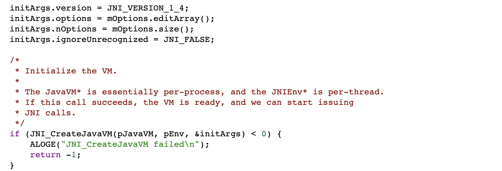

# JavaVM和JNIEnv

## JavaVM

JavaVM就是虚拟机环境，一个进程只允许创建一个虚拟机。

当 Java 层访问 Nativce 层的时候会自动在 JNI 层创建一个 JavaVM 指针，而我们在 JNI 层通常所使用的都是从 JavaVM 中获取的 JNIEnv 指针。

看看它在jni.h中的定义：

```c
/*
 * C++ version.
 */
struct _JavaVM {
    const struct JNIInvokeInterface* functions;

#if defined(__cplusplus)
    jint DestroyJavaVM()
    { return functions->DestroyJavaVM(this); }
    jint AttachCurrentThread(JNIEnv** p_env, void* thr_args)
    { return functions->AttachCurrentThread(this, p_env, thr_args); }
    jint DetachCurrentThread()
    { return functions->DetachCurrentThread(this); }
    jint GetEnv(void** env, jint version)
    { return functions->GetEnv(this, env, version); }
    jint AttachCurrentThreadAsDaemon(JNIEnv** p_env, void* thr_args)
    { return functions->AttachCurrentThreadAsDaemon(this, p_env, thr_args); }
#endif /*__cplusplus*/
};

/*
 * JNI invocation interface.
 */
struct JNIInvokeInterface {
    void*       reserved0;
    void*       reserved1;
    void*       reserved2;

    jint        (*DestroyJavaVM)(JavaVM*);
    jint        (*AttachCurrentThread)(JavaVM*, JNIEnv**, void*);
    jint        (*DetachCurrentThread)(JavaVM*);
    jint        (*GetEnv)(JavaVM*, void**, jint);
    jint        (*AttachCurrentThreadAsDaemon)(JavaVM*, JNIEnv**, void*);
};
```

### 关于JavaVM的创建

从Java层到Native层的开发的时候，我们并不需要手动创建JavaVM对象，因此虚拟机自动帮我们完成了这些工作。然而，如果从Native层到Java层开发的时候，我们就需要手动创建JavaVM对象，创建的函数原型如下：

```c
jint JNI_CreateJavaVM(JavaVM** p_vm, JNIEnv** p_env, void* vm_args);
```

* `p_vm`：是一个指向 JavaVM * 的指针，函数成功返回时会给 JavaVM *指针赋值
* `p_env`：是一个指向 JNIEnv * 的指针，函数成功返回时会给 JNIEnv * 指针赋值
* `vm_args`：是一个指向 JavaVMInitArgs 的指针，是初始化虚拟机的参数

JavaVMInitArgs的定义：

```c
typedef struct JavaVMInitArgs {
    jint        version;    /* use JNI_VERSION_1_2 or later */
    jint        nOptions;
    JavaVMOption* options;
    jboolean    ignoreUnrecognized;
} JavaVMInitArgs;
```

### 示例：Zygote创建JavaVM

在andorid源码`frameworks/base/core/jni/AndroidRuntime.cpp`中，启动android runtime中就要创建JavaVM：

```c
void AndroidRuntime::start(const char* className, const Vector<String8>& options, bool zygote)
{
	/* start the virtual machine */
    	JniInvocation jni_invocation;
    	jni_invocation.Init(NULL);
    	JNIEnv* env;
    	if (startVm(&mJavaVM, &env, zygote, primary_zygote) != 0) {
      	 	 return;
    	}
    	onVmCreated(env);
    	
    	/*
    	 * Register android functions.
     	*/
    	if (startReg(env) < 0) {
        	ALOGE("Unable to register all android natives\n");
        	return;
    	}
    	
    	ALOGD("Shutting down VM\n");
    	if (mJavaVM->DetachCurrentThread() != JNI_OK)
      	  	ALOGW("Warning: unable to detach main thread\n");
		if (mJavaVM->DestroyJavaVM() != 0)
        	ALOGW("Warning: VM did not shut down cleanly\n");
}
```

其中startVm的核心：



## JNIEnv

### 创建JNIEnv

jni.h中创建方法的定义：

```c
jint GetEnv(JavaVM *vm, void **env, jint version);
```

* vm：虚拟机对象
* env：一个指向 JNIEnv 结构的指针的指针
* version：JNI版本

这个函数执行结果有几种情况:

1. 如果当前线程没有附着到虚拟机中，也就是没有调用`JavaVM`的 `AttachCurrentThread()`函数，那么就会设置`env`的值为`NULL`，并且返回 `JNI_EDETACHED`(值为-2)。
2. 如果参数version锁指定的版本不支持，那么就会设置`env`的值为`NULL`，并且返回`JNI_EVERSION`(值为-3)。
3. 除去上面的两种异常情况，就会给`env`设置正确的值，并且返回`JNI_OK`(值为0)。

### JNIEnv的限制

* `JNIEnv * env` 是与线程相关，因此多个线程之间不能共享同一个`env`。
* 如果在`Native层新建一个线程，要获取`JNIEnv * env`，那么必须做到如下两点：
 * 线程必须调用`JavaVM`的`AttachCurrentThread()`函数。
 * 必须全局保存`JavaVM * mJavaVm`，那么就可以在线程中通过调用`JavaVM`的 `getEnv()`函数来获取`JNIEnv * env`的值。
